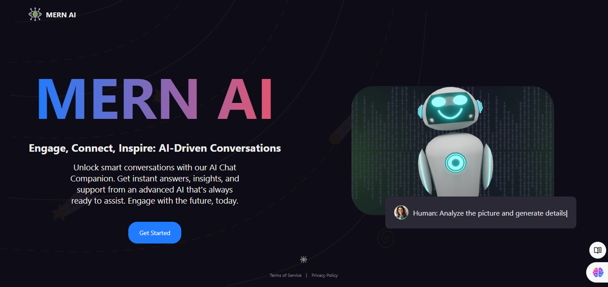

# MERN AI

An AI-powered MERN stack web application utilizing Google Gemini for Q&A. Users can sign up, log in, ask questions, and upload images for AI analysis. All conversations are stored, allowing users to review past interactions.



## Features

- **User Authentication**: Log in or sign up using GitHub, Google, or email.
- **Dashboard**: Access a personalized AI dashboard.
- **AI Q&A**: Chat with AI powered by Google Gemini to get answers to your questions.
- **Image Analysis**: Upload images for AI to analyze and provide responses.
- **Chat History**: All conversations are saved, allowing users to check previous chats.

## Tech Stack

### Frontend
- React 19
- `@clerk/clerk-react`
- `@tanstack/react-query`
- `react-router-dom`
- `react-markdown`
- `react-type-animation`
- `imagekitio-react`

### Backend
- `@clerk/clerk-sdk-node`
- `cors`
- `express`
- `imagekit`
- `mongoose`
- MongoDB
- Node.js

## Installation

1. **Clone the Repository**

   ```bash
   git clone https://github.com/Rohit-2012/mern-ai.git

2. **Install Dependencies**
   - For the backend:
     ```bash
     cd ./backend/
     npm install
   - For the frontend:
     ```bash
     cd ./frontend/
     npm install -f

3. **Setup Environment Variables**
   Create a .env file in the root directories of both the backend and frontend, with the following variables:
   - .env
     
    ```
    IMAGE_KIT_ENDPOINT=<your Image kit endpoint>
    IMAGE_KIT_PUBLIC_KEY=<image kit public key>
    IMAGE_KIT_PRIVATE_KEY=<image kit private key>
    CLIENT_URL=<frontend URL>
    MONGO=<MongoDB URI>
    CLERK_PUBLISHABLE_KEY=<Clerk publishable key>
    CLERK_SECRET_KEY=<Clerk secret key>
    VITE_CLERK_PUBLISHABLE_KEY=<Clerk publishable key>
    VITE_IMAGE_KIT_ENDPOINT=<Image kit endpoint>
    VITE_IMAGE_KIT_PUBLIC_KEY=<Image kit public key>
    VITE_GEMINI_PUBLIC_KEY=<Google Gemini API key>
    VITE_API_URL=<Backend API URL>
**Feel free to adjust the content and formatting as needed!**
